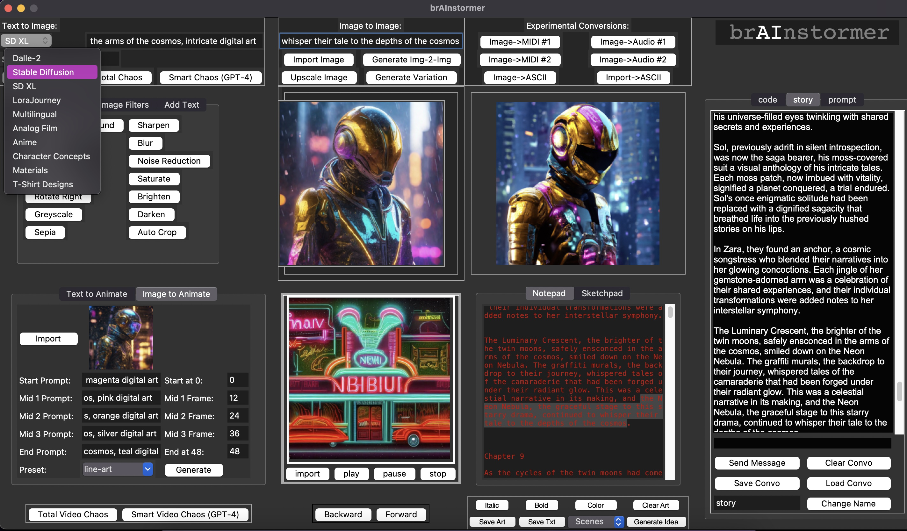
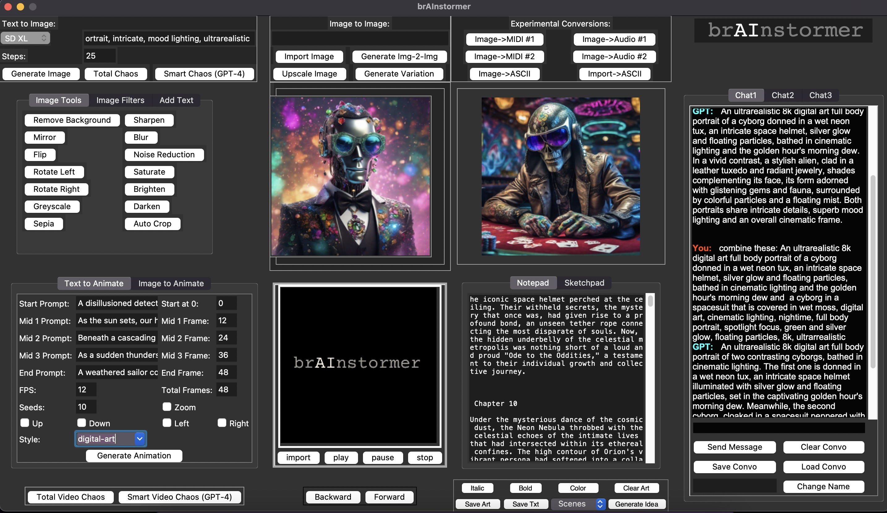

<div align="center">

# 🎨 brAInstormer 1.0

**The original all-in-one AI creative suite — everything on one screen, no tab-switching**


</div>

---

brAInstormer 1.0 is a desktop creative suite that packs image generation, animation, image editing, ChatGPT, a sketchpad, a notepad, and experimental file conversions into a single Tkinter window. No scrolling, no switching apps — everything in one place.

## ✨ Features

- **Text-to-Image** — DALL-E 2 AND Stable Diffusion generation, side by side
- **Image Editing** — 30+ visual effects: pixelate, solarize, VHS glitch, sepia, mirror, vignette, and more
- **Image Upscaling** — enlarge any image to 2048×2048
- **Image-to-Image** — use any image as a starting point for text-guided generation
- **Image Variations** — generate endless versions of any output
- **Text-to-Animation** — generate 48-frame animations with camera controls, 10+ style presets, GPT-powered randomization
- **Image-to-Animation** — import any image and animate it
- **ChatGPT** — host up to 3 simultaneous GPT-4 conversations, each with a custom role
- **Experimental Conversions** — convert images to audio, MIDI, and more
- **Sketchpad** — quick concept doodles with full color spectrum control
- **Notepad** — with 10+ GPT-powered concept shufflers (movie scenes, art styles, trinket lists…)

## 🚀 Quick Start

```bash
git clone https://github.com/RhythrosaLabs/brainstormer_1.0.git
cd brainstormer_1.0
pip install openai stability-sdk pillow tkinter
python brainstormer.py
```

Get API keys from [platform.openai.com](https://platform.openai.com) and [dreamstudio.ai](https://dreamstudio.ai), then enter them on first launch.

## 🛠️ Tech Stack

- **Python + Tkinter** — single-window desktop GUI
- **OpenAI API** — GPT-4, DALL-E 2
- **Stability AI** — Stable Diffusion image and animation generation
- **Pillow** — image processing and effects

## 📸 Screenshots




## 🤝 Contributing

PRs welcome. Open an issue first for major changes.

## 📄 License

MIT

## 💛 Support

If brAInstormer sparked something creative, consider supporting development:

👉 [Donate via PayPal](https://paypal.me/noodlebake) — @noodlebake

---
<div align="center">Made with ❤️ by <a href="https://github.com/RhythrosaLabs">RhythrosaLabs</a></div>
